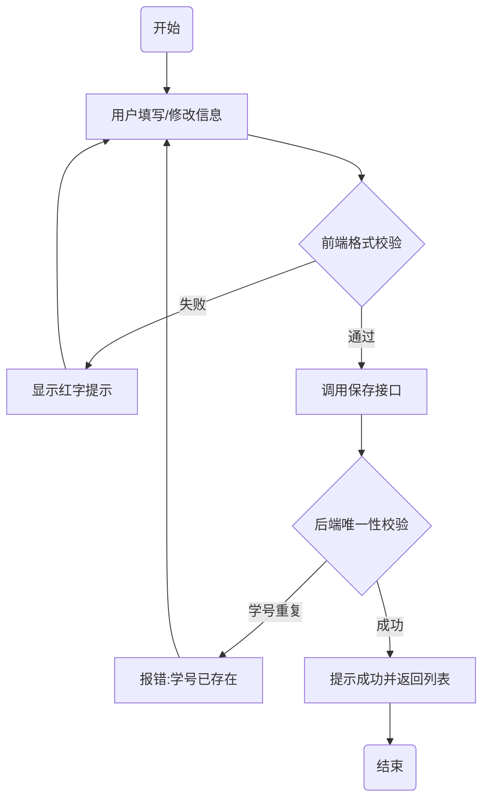

# 校园教务系统 - 学生管理模块 PRD

## 0. 文档修订记录
| 版本号 | 修改日期 | 修改人 | 修改内容 | 备注 |
| :--- | :--- | :--- | :--- | :--- |
| V1.0 | 2025-11-27 | 产品经理A | 初始版本：包含列表、新增、编辑功能 | 删除功能暂延后 |

---

## 1. 项目背景与目标
### 1.1 背景
当前学生信息管理仍采用 Excel 线下流转，容易导致数据版本不一致，且查询效率低。需要实现学生信息的线上化管理。

### 1.2 目标
*   实现学生档案 100% 线上化存储。
*   辅导员查询学生信息耗时从 5分钟/人 降低至 5秒/人。

### 1.3 范围
*   **包含：** 学生列表查询、新增学生档案、编辑学生档案。
*   **不包含：** 批量导入导出（二期规划）、学生成绩管理。

---

## 2. 全局规约 (Global Rules)
*   参见 [全局交互规范文档](./PRD_STANDARD_TEMPLATE.md#2-全局规约-global-rules)
*   **敏感数据：** 列表中手机号需脱敏显示 (e.g., 138****1234)，点击“查看”图标后才显示明文。

---

## 3. 业务流程图
### 3.1 新增/编辑学生流程

---

## 4. 功能需求详细说明

### 4.1 学生列表 (Student List)

#### 4.1.1 页面元素定义

| 元素名称 | 类型 | 规则/说明 | 默认值 |
| :--- | :--- | :--- | :--- |
| **搜索栏-姓名** | 输入框 | 支持模糊搜索 | 空 |
| **搜索栏-状态** | 下拉选 | 选项：在读、休学、毕业 | 全部 |
| **搜索按钮** | 按钮 | 点击触发列表刷新 | - |
| **列表-学号** | 文本 | 唯一标识，不可点击 | - |
| **列表-姓名** | 文本 | 最多显示10个字，超出... | - |
| **操作列** | 按钮组 | 包含 [编辑] [详情] 按钮 | - |

#### 4.1.2 交互逻辑
*   **默认排序：** 按 `入学年份` 倒序排列。
*   **翻页：** 每页默认 20 条。

---

### 4.2 新增/编辑学生 (Add/Edit Student)

#### 4.2.1 界面原型
> (此处应放原型图，本示例省略)

#### 4.2.2 字段逻辑表 (重点)

| 字段名称 | 必填 | 类型 | 长度/范围 | 校验逻辑 | 错误提示 |
| :--- | :--- | :--- | :--- | :--- | :--- |
| **头像** | 否 | 图片上传 | Max 2MB | 仅支持 jpg/png | 图片格式错误/过大 |
| **姓名** | 是 | 文本 | 2-20字符 | 禁止特殊符号 | 请输入有效姓名 |
| **学号** | 是 | 文本 | 正好10位 | **新增时：** AJAX查重 **编辑时：** 置灰不可改 | 学号已存在/格式错误 |
| **性别** | 是 | 单选 | 男/女 | - | - |
| **手机号** | 是 | 数字 | 11位 | 正则校验手机格式 | 手机号格式不正确 |
| **入学时间** | 是 | 日期 | 2000-至今 | 不能选未来时间 | 日期无效 |

#### 4.2.3 关键逻辑说明
1.  **状态回显（编辑模式）：**
    *   进入页面时，调用 `GET /api/student/{id}` 获取详情。
    *   若数据获取失败，弹窗提示“数据不存在或已被删除”，点击确认返回列表。
2.  **学号查重：**
    *   在输入框失去焦点 (onBlur) 时，若内容发生变化，立即调用 `CheckStudentID` 接口。
    *   若重复，输入框变红，下方提示“该学号已存在”。

#### 4.2.4 异常处理
*   **保存时断网：** 提示“网络连接失败”，**不**清空表单，允许用户重试。
*   **并发冲突：** 编辑保存时，若后端检测到该记录已被他人修改（基于 version 字段），前端弹窗：“当前数据已被其他人修改，请刷新后重新编辑”。

---

## 5. 埋点需求
*   **列表页：** 统计“搜索”按钮的点击次数，分析高频搜索词。
*   **新增页：** 统计“保存”接口的报错率（区分业务报错和系统报错）。
