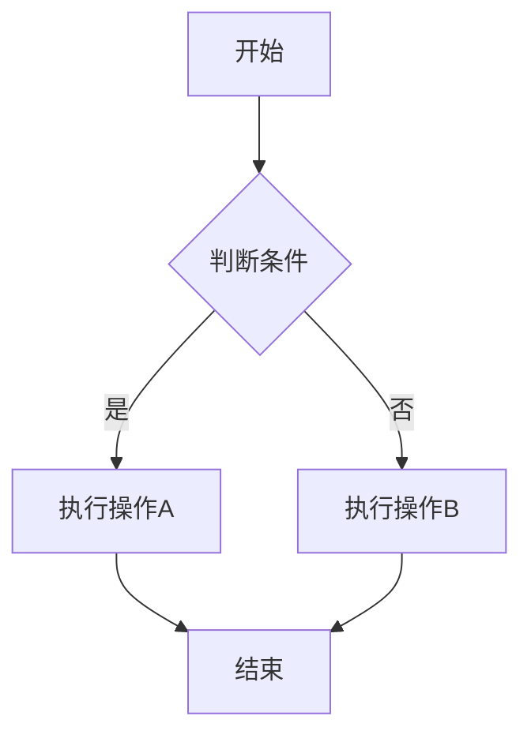

# [项目名称] 产品需求文档 (PRD)

## 0. 文档修订记录
| 版本号 | 修改日期 | 修改人 | 修改内容 | 备注 |
| :--- | :--- | :--- | :--- | :--- |
| V1.0 | 2023-10-27 | [你的名字] | 初始版本创建 | |

---

## 1. 项目背景与目标
### 1.1 背景
> 用一句话描述为什么要做这个功能？解决了什么痛点？

### 1.2 目标
> 核心业务指标是什么？（例如：提高录入效率30%，或实现数据线上化）

### 1.3 范围 (Scope)
*   **包含：** [列出本次迭代包含的功能]
*   **不包含：** [明确列出不做的功能，防止需求蔓延]

---

## 2. 全局规约 (Global Rules)
> **注意：** 此处定义通用的规则，避免在每个页面重复写。

### 2.1 交互/UI 规范
*   **空状态：** 所有列表无数据时，显示“暂无数据”插画。
*   **加载中：** 接口请求超过 500ms 时，必须显示全局 Loading。
*   **网络异常：** 接口报错（非 200），统一 Toast 提示“网络开小差了，请稍后重试”。
*   **表单验证：** 必填项标红星 (*)，点击提交时进行校验，错误提示在输入框下方显示红色文字。

### 2.2 数据规范
*   **时间格式：** 全局统一为 `YYYY-MM-DD HH:mm:ss`。
*   **金额格式：** 保留两位小数，千分位分隔 (e.g., 1,234.56)。

### 2.3 权限说明
| 角色 | 权限描述 |
| :--- | :--- |
| 管理员 | 拥有增删改查所有权限 |
| 普通用户 | 仅可查看，不可编辑 |

---

## 3. 业务流程图 (Process Flow)
> 必须包含流程图，说明业务的流转。推荐使用 Mermaid 语法或图片。

---

## 4. 功能需求详细说明 (Functional Requirements)

> **核心原则：** 一个功能模块（如“学生管理”）作为一个整体描述，而不是拆分成碎片的页面。

### 模块一：[模块名称，如：学生管理]

#### 4.1 界面原型 (Prototype)
> 在此处插入原型截图或 Figma 链接。

#### 4.2 页面元素与逻辑定义 (关键！)
> **开发&测试最看重部分：** 请详细定义每个字段的规则。

| 字段/元素名称 | 类型 | 长度限制 | 必填 | 默认值 | 逻辑规则/校验说明 |
| :--- | :--- | :--- | :--- | :--- | :--- |
| **学生姓名** | 输入框 | 2-20字符 | 是 | 空 | 1. 支持中英文 2. 禁止特殊符号 |
| **年龄** | 数字输入 | 1-100 | 是 | - | 1. 只能输入正整数 2. 大于 100 提示“请输入有效年龄” |
| **所属班级** | 下拉选 | - | 是 | 请选择 | 1. 数据来源：`GET /api/classes` 2. 单选 |
| **入学日期** | 日期控件 | - | 否 | 当天 | 1. 禁止选择未来日期 |
| **提交按钮** | 按钮 | - | - | - | 1. 点击触发校验 2. 提交中置灰不可点(Loading) 3. 成功后跳转列表页 |

#### 4.3 操作流程与交互
1.  **进入页面：**
    *   初始化请求 `xxx` 接口获取默认配置。
    *   若无权限，重定向至 403 页面。
2.  **提交操作：**
    *   **前置条件：** 所有必填项校验通过。
    *   **后端处理：** 需校验学号是否重复（唯一性检查）。
    *   **反馈：**
        *   成功：Toast 提示“保存成功”，延迟 1s 返回列表并刷新。
        *   失败（学号重复）：弹窗提示“该学号已存在，请检查”。

#### 4.4 异常流程 (Exception Case)
*   **断网提交：** 本地缓存数据，提示网络错误。
*   **数据冲突：** 多人同时编辑同一记录时，后提交者提示“数据版本过期，请刷新后重试”。

---

## 5. 非功能需求 (Non-Functional)
### 5.1 性能要求
*   列表加载速度需在 1秒内 (WIFI环境)。
*   支持并发用户数：> 1000。

### 5.2 数据埋点 (Analytics)
*   **事件：** 点击“提交”按钮。
*   **参数：** 记录用户ID、操作时间、操作结果(成功/失败)。
