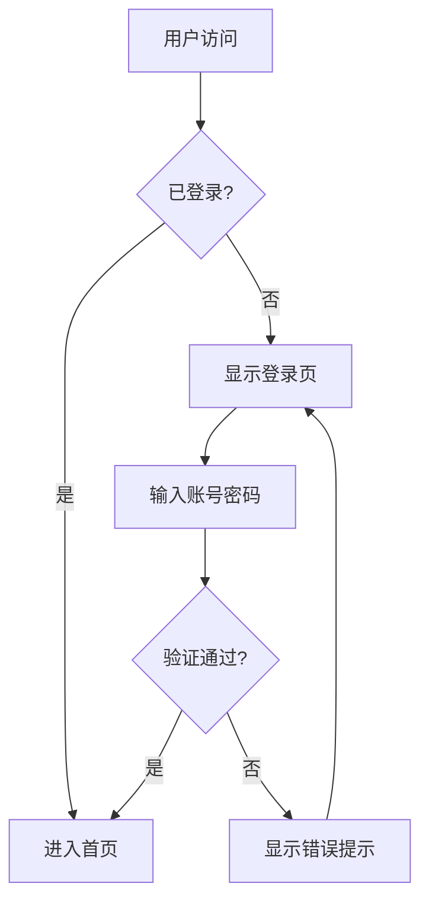
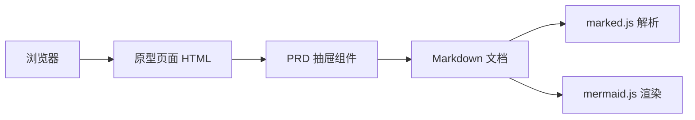

# 示例产品需求文档 (PRD)

## 1. 项目概述

### 1.1 项目背景

本项目旨在创建一个集成的文档查看系统，支持在浏览器中同时查看：

- HTML 页面原型
- Markdown 格式的 PRD 文档

### 1.2 目标用户

- 产品经理
- 前端开发人员
- UI/UX 设计师

## 2. 功能需求

### 2.1 核心功能

| 功能          | 描述                           | 优先级 |
| ------------- | ------------------------------ | ------ |
| Markdown 渲染 | 将 .md 文件渲染为格式化的 HTML | P0     |
| 页面预览      | 在 iframe 中展示 HTML 原型     | P0     |
| 导航侧边栏    | 快速切换不同文档               | P1     |

### 2.2 技术方案

使用 `marked.js` 库进行 Markdown 解析：

```javascript
const html = marked.parse(markdownText);
```

## 3. 使用说明

1. 将你的 **PRD 文档**（.md 文件）放入 `docs/` 目录
2. 将你的 **页面原型**（.html 文件）放入 `pages/` 目录
3. 在 `index.html` 的侧边栏中添加对应的导航链接

> 💡 **提示**：修改 `index.html` 中的导航部分即可添加新文档

## 4. 流程图示例

### 用户登录流程



### 系统架构



## 5. 下一步计划

- [ ] 支持自动扫描目录生成导航
- [ ] 添加搜索功能
- [ ] 支持文档目录 (TOC)
