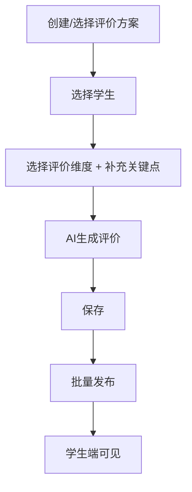

# [学生评价体系] 产品需求文档

## 0. 文档修订记录

| 版本号 | 修改日期   | 修改人 | 修改内容     | 备注                       |
| :----- | :--------- | :----- | :----------- | :------------------------- |
| V3.0   | 2025-12-02 | Arlen  | UI 优化迭代  | 课堂点评按钮位置调整、去掉学期字段、Toast 通知统一 |
| V3.0   | 2025-12-01 | Arlen  | 初始版本创建 | 基于原型设计及业务需求确认 |

---

## 1. 项目背景与目标

### 1.1 背景

建立一套完整的“过程性+总结性”双轨评价体系，覆盖学生日常课堂表现和期末/阶段性总结，解决以往评价数据碎片化、评价维度单一的问题。

### 1.2 目标

* 实现**课堂点评**的即时记录与可视化，提升课堂互动性。
* 实现**综合评价**的标准化与效率化，通过结构化方案管理评价内容。
* 明确数据权限与可见性，保障评价数据的私密性与合规性。

### 1.3 范围

* **包含：**
  * **综合评价模块**：基于“班级+学科”的方案管理、关键点辅助/手动评语撰写、发布状态管理。
  * **课堂点评模块**：基于“班级+学科”的日常点评、教师个人徽章库、点评流水与统计。
* **不包含：** 家长端/学生端的具体交互设计（本文档仅定义数据可见性接口逻辑）。

---

## 2. 全局规约

### 2.1 筛选与上下文

* **页面级上下文（父级）**：
  * 页面顶部常驻 `班级` 和 `学科` 两个筛选器。
  * **综合评价模块**：完全继承父级上下文。创建新评价方案时，自动锁定为当前选中的班级和学科。
* **窗口级上下文（独立）**：
  * **课堂点评窗口**：
    * **初始化**：默认继承页面顶部的 `班级` 和 `学科`。
    * **时段筛选**：提供数据展示时段选择，默认为"近六个月"，可切换为近一周、近一个月、近一年、全部数据。
    * **独立性**：窗口内提供独立的班级、学科、时段筛选器，用户调整窗口内的筛选条件不影响页面外部的父级筛选状态。

### 2.2 权限说明

| 角色           | 权限范围                                                                                                                                                                                                             |
| :------------- | :------------------------------------------------------------------------------------------------------------------------------------------------------------------------------------------------------------------- |
| **老师** | **严格的学科+班级隔离**：老师仅有权限查看和操作自己所任教班级及对应学科的数据。无论是"课堂点评"还是"综合评价"，均遵循此规则。例如：三年二班的语文老师，仅能查看/操作该班级语文学科的数据，不可见数学学科数据。 |

## 3. 业务流程图

### 3.1 综合评价核心流程



---

## 4. 功能需求详细说明

### 4.1 综合评价

> **定位**：基于"班级+学科"维度的总结性评价（如期末评语）。

#### 4.1.1 评价方案管理

> 创建、编辑、删除评价方案。

* **数据归属**：方案属于 `班级 + 学科`。

##### 创建方案表单

| 字段名称 | 类型     | 必填 | 默认值/规则                                                |
| :------- | :------- | :--- | :--------------------------------------------------------- |
| 方案名称 | 输入框   | 是   | 用户自定义输入，最多 30 字。                               |
| 评价类型 | 下拉选择 | 是   | 默认为空，需用户选择。选项：日常评价 / 期中评价 / 期末评价 |

**唯一性校验**：

* 方案名称不可重复。

##### 方案列表

* **排序规则**：按创建时间降序排列（最新创建的方案显示在最上面）。
* **方案卡片显示**：评价类型标签、方案名称、完成进度（已评人数/总人数）。
* **已评人数定义**：评价内容不为空的学生数量（与发布状态无关）。

##### 方案操作

| 操作   | 说明                                 |
| :----- | :----------------------------------- |
| 重命名 | 修改方案名称，需校验名称唯一性       |
| 删除   | 删除方案及其所有评价内容，需二次确认 |

**操作反馈**

> 注：表格中"行内提示"在实现时统一采用 Toast 形式展示。

| 操作     | 场景         | 提示语                                           | 形式     |
| :------- | :----------- | :----------------------------------------------- | :------- |
| 创建方案 | 方案名称为空 | 请输入方案名称                                   | 行内提示 |
| 创建方案 | 方案名称重复 | 该方案名称已存在                                 | 行内提示 |
| 创建方案 | 未选择类型   | 请选择评价类型                                   | 行内提示 |
| 创建方案 | 创建成功     | 评价方案创建成功                                 | Toast    |
| 重命名   | 方案名称为空 | 请输入方案名称                                   | 行内提示 |
| 重命名   | 方案名称重复 | 该方案名称已存在                                 | 行内提示 |
| 重命名   | 重命名成功   | 重命名成功                                       | Toast    |
| 删除方案 | 二次确认     | 确定要删除这个评价方案吗？所有评价内容将被清除。 | 弹窗确认 |
| 删除方案 | 删除成功     | 评价方案已删除                                   | Toast    |

#### 4.1.2 评价列表与状态管理

> 学生列表展示、筛选、状态流转。

* **列表字段**：学生姓名、学号、状态、评价内容预览、操作按钮。
* **状态筛选**：全部状态 / 未填写 / 未发布 / 已发布。
* **状态流转**：`未填写` → `未发布` → `已发布`。

| 状态   | 说明               | 学生端可见性 |
| :----- | :----------------- | :----------- |
| 未填写 | 尚未撰写评价       | 不可见       |
| 未发布 | 已撰写评价，未发布 | 不可见       |
| 已发布 | 已发布             | 可见         |

#### 4.1.3 评价撰写

> 维度选择、关键点输入、AI生成、编辑保存。

* **内容格式**：纯文本（不支持富文本）。
* **操作流程**：

  1. 选择学生（支持单选或批量勾选）。
  2. 为每个评价维度选择一个评价项。
  3. 输入补充关键点（选填）。
  4. 点击"生成评价"，直接跳转到生成结果页，AI 流式输出评语。
  5. 人工微调后保存。
* **重新生成规则**：

  - 在生成结果页点击"重新生成"，返回维度选择页。
  - 如果是从维度选择页跳转过来的，返回时保留用户的维度选择和补充关键点。
  - 如果是从编辑入口直接进入生成结果页的，首次返回时清空选择，让用户重新选择；后续返回则保留选择。

| 字段/元素名称 | 类型     | 必填 | 限制/规则                       |
| :------------ | :------- | :--- | :------------------------------ |
| 评价维度      | 多组单选 | 是   | 每个维度必须选择一项            |
| 补充关键点    | 文本域   | 否   | 最多 200 字，输入框显示字数统计 |
| 评价内容      | 文本域   | 是   | 最多 500 字，输入框显示字数统计 |

**操作反馈**

> 注：表格中"行内提示"在实现时统一采用 Toast 形式展示。

| 场景               | 提示语           | 形式     | 说明                                                 |
| :----------------- | :--------------- | :------- | :--------------------------------------------------- |
| 评价维度未全部选择 | 请选择一项       | 行内提示 | 在未选择的维度标题后显示                             |
| AI 生成失败        | 生成失败，请重试 | Toast    | 在生成结果页提示，用户可点击"重新生成"返回维度选择页 |
| 保存成功           | 保存成功         | Toast    | -                                                    |

#### 4.1.4 发布与隐藏

> 单条/批量发布、隐藏撤回。

* **单条发布**：针对单个学生点击"发布"按钮。
* **批量发布**：勾选多个学生后，点击"批量发布"。
* **隐藏/撤回**：已发布的评价可点击"隐藏"，状态回退为"未发布"，学生端不可见。
* **修改后逻辑**：已发布状态下修改内容并保存，状态保持"已发布"，学生端可以看到更新后的评价。

**操作反馈**

| 场景           | 提示语                   | 形式  |
| :------------- | :----------------------- | :---- |
| 单条操作成功   | 已发布 / 已隐藏          | Toast |
| 批量操作有变更 | 已发布/隐藏 N 条评价     | Toast |
| 批量操作无变更 | 所选学生暂无可操作的评价 | Toast |

> 说明：N 为实际状态变更的评价数量；无内容或已是目标状态的学生静默跳过，不单独提示。

---

### 4.2 课堂点评

> **定位**：基于"班级+学科"的高频日常记录工具，支持按时段筛选，以独立弹窗形式运行。

* **组件特性**：课堂点评为独立组件，可被其他功能模块按需调用。

#### 4.2.1 点评操作

> 选择学生、点击徽章、实时记录。

* **入口**：当前原型中为页面右下角悬浮按钮；后续可扩展为工具栏按钮、快捷键等多种入口。
* **操作流程**：

  1. 在左侧学生列表中点击选择一个学生（支持搜索）。
  2. 在中间区域点击对应的徽章（正向激励 / 待改进）。
  3. 点击即生效，徽章上方浮现 +1/-1 动画反馈。
  4. 右侧流水实时更新，学生统计数实时刷新。
* **统计展示**：每个学生显示点赞数和批评数（独立计数，不抵消）。

| 字段/元素名称 | 类型     | 说明                                                         |
| :------------ | :------- | :----------------------------------------------------------- |
| 学生列表      | 左侧面板 | 显示学生姓名、点赞数、批评数，按姓名拼音首字母升序，支持搜索 |
| 徽章区域      | 中间面板 | 分为"正向激励"和"待改进"两组                                 |
| 点评流水      | 右侧面板 | 当前学生的点评时间线                                         |

#### 4.2.2 徽章管理

> 系统徽章、自定义徽章增删。

* **徽章归属**：跟随教师账号（非班级/学科）。
* **系统预置徽章**：每类 8 个，不可删除、不可修改。
* **自定义徽章**：每类最多添加 4 个，支持删除。

| 字段/元素名称 | 类型   | 必填 | 限制/规则                           |
| :------------ | :----- | :--- | :---------------------------------- |
| 徽章名称      | 输入框 | 是   | 2~4 字                              |
| 徽章类型      | -      | -    | 由所在区域决定（正向激励 / 待改进） |
| 数量限制      | -      | -    | 每类：系统 8 个 + 自定义最多 4 个   |

**操作反馈**

> 注：表格中"行内提示"在实现时统一采用 Toast 形式展示。

| 场景                 | 提示语                    | 形式  |
| :------------------- | :------------------------ | :---- |
| 添加自定义徽章超上限 | 最多只能添加4个自定义徽章 | Toast |

#### 4.2.3 点评流水与撤销

> 时间线展示、删除记录。

* **显示范围**：当前班级 + 学科下，选中学生的点评记录，支持按时段筛选展示。
* **排序**：按时间降序（最新在上）。
* **撤销/删除**：每条记录右侧显示删除按钮，点击删除后对应学生的统计数自动回扣。

| 字段     | 说明                                                                            |
| :------- | :------------------------------------------------------------------------------ |
| 时间     | 今天：`今天 HH:mm`；今年非今天：`MM-DD HH:mm`；非今年：`YYYY-MM-DD HH:mm` |
| 徽章名称 | 本次点评使用的徽章                                                              |
| 分值     | +1（正向，绿色）或 -1（待改进，红色）                                           |

#### 4.2.4 发布控制

> 开关逻辑、学生端可见性。

* **功能入口**：弹窗顶部的"已发布/未发布"开关。
* **控制范围**：当前 `班级 + 学科` 下的所有点评数据。
* **默认值**：OFF（未发布）。
* **行为**：
  * ON：学生端可见当前班级 + 学科下，自己的点评数据。
  * OFF：学生端不可见当前班级 + 学科下，自己的点评数据。

**操作反馈**

> 注：表格中"行内提示"在实现时统一采用 Toast 形式展示。

| 场景       | 提示语               | 形式  |
| :--------- | :------------------- | :---- |
| 切换为发布 | 已发布，学生端可查看 | Toast |
| 切换为隐藏 | 已取消发布           | Toast |

---

## 5. AI 提示词配置

### 5.1 综合评价生成

> 用于 4.1.3 评价撰写中的"生成评价"功能。

```
你是一位经验丰富的班主任，擅长撰写温暖、具体、有建设性的学生评语。

请根据以下评价维度和补充信息，生成一段综合评语。

## 评价维度选择
- 课堂表现：{课堂表现}
- 作业完成：{作业完成}
- 学科能力：{学科能力}
- 学习习惯：{学习习惯}
- 品行纪律：{品行纪律}

## 补充关键点
{补充关键点}

## 要求
1. 评语应在 150~300 字之间
2. 语气亲切、正面鼓励为主，指出不足时注意措辞委婉
3. 结合所选维度自然融入评价，避免逐条罗列
4. 若有补充关键点，需体现在评语中
5. 结尾给出期望或鼓励
```

---

## 6. 非功能需求

### 6.1 性能要求

> 暂无，后续按需补充。

### 6.2 数据埋点

> 暂无，后续按需补充。
