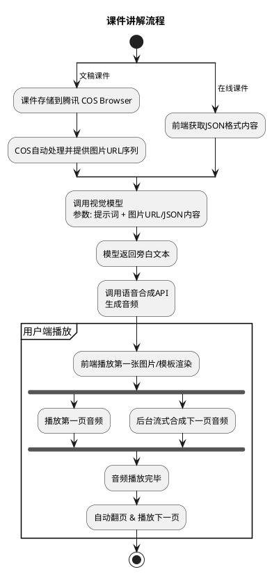
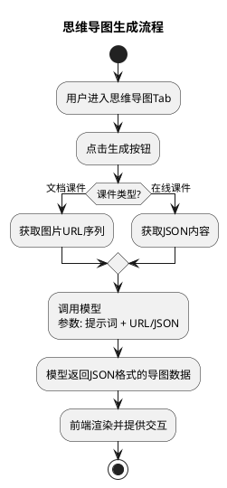
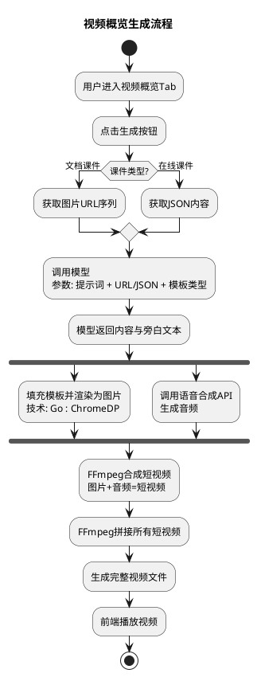

# AI 课件讲解功能需求文档

## 1. 修订历史

| 版本号 | 修订日期   | 修订人 | 修订内容 |
| :----- | :--------- | :----- | :------- |
| V1.0   | 2025-10-22 | Gemini | 创建文档 |

## 2. 项目概述

AI 课件讲解功能是奕兆教育软件中的一个创新模块，旨在利用人工智能技术，将用户上传的静态课件或在线课件转化为包含智能语音讲解、思维导图和视频概览的动态、多媒体教学资源。极大地提升了教学内容的吸引力和学习效率。

简单来说，该功能的核心就是为用户上传的课件，自动生成以下三种核心的AI教学材料：

*   **课件讲解**： 为每一页课件生成同步的讲解音频，并实现自动翻页播放。
*   **思维导图**： 基于课件内容，自动生成结构化的思维导图，支持前端交互。
*   **视频概览**： 自动生成一段精炼的视频，对课件内容进行总结和概览。

本项目原型主要涵盖两大核心流程：**新课件的上传与AI处理流程** 和 **已有课件的管理与播放流程**。

## 3. 方案核心流程与技术路径

整个方案的核心在于如何将课件内容（PPT/在线 JSON）转化为模型可处理的输入，再将模型的输出转化为最终的用户可感知的内容（音频、图片、视频）。

### 3.1 课件讲解流程

此流程处理用户上传的文档课件和系统内的在线课件两种情况。



**关键技术点**：

*   **文件处理**： 依赖 `腾讯 COS Browser` 自动解析并生成文档图片 URL。
*   **多模态处理**： 调用视觉模型，根据图片或结构化 JSON 内容生成高质量结构化的旁白文本。
*   **音频合成**： 使用语音合成 API 将旁白文本转化为音频。
*   **前端同步**： 前端需实现音频播放与图片/模板渲染的同步，并支持流式播放，即在播放第一页音频的同时，后台并行合成下一页的音频。

### 3.2 思维导图生成流程

该功能由用户手动触发，主要为用户提供结构化的知识梳理。



**关键技术点**：

*   **数据生成**： 同样调用模型，但提示词侧重于结构化，让模型直接返回可供前端渲染的 JSON 格式数据。
*   **前端组件**： 前端需要一个功能强大的思维导图交互组件，能够美观地渲染 JSON 数据，并支持节点的展开、收起等操作。

### 3.3 视频概览生成流程

该功能也由用户手动触发，需要后端进行复杂的音视频合成。



**关键技术点**：

*   **图片渲染**： 后端负责将模型返回的内容，通过其技术栈（例如 Go 语言结合 `ChromeDP` 等方案），填充到预设模板并渲染成图片。
*   **音视频合成**： 核心技术点是使用 `FFmpeg`。它能够将图片和音频文件合成为单个视频片段，并将所有片段拼接成一个完整的视频文件。
*   **并行处理**： 图片渲染和音频合成这两个耗时任务需要并行执行，以缩短用户等待时间。

## 4. 功能详述

### 4.1. 课件管理与侧栏

#### a. 整体布局

页面左侧为课件管理侧栏，固定显示，用于浏览、搜索和管理用户的所有课件。

#### b. 课件列表

1.  **加载方式**：
    *   采用无限滚动加载机制。
    *   首次进入页面加载前20条数据。
    *   当用户滚动列表至底部时，自动加载后续20条数据，直至所有课件加载完毕。
2.  **列表项显示**：
    *   **图标**：根据课件类型（本地PPT、在线课件）显示不同的图标，以作区分。
    *   **课件名称**：显示用户上传的文件名或在线课件的标题。
    *   **页数**：显示该课件的总页数。
    *   **选中状态**：当前正在右侧内容区查看的课件，在列表中应有高亮或边框等视觉提示。

#### c. 功能操作

1.  **上传新课件**：
    *   侧栏顶部提供“本地文件”和“在线课件”两个入口按钮。
    *   点击“本地文件”，弹出文件选择框，支持 `ppt` 和 `pptx` 格式。
    *   点击“在线课件”，弹出在线课件库选择模态框。
2.  **关键词搜索**：
    *   列表上方提供一个搜索框，用户可输入关键词进行实时搜索。
    *   搜索为实时响应，需进行防抖（debounce）处理（建议延迟300ms），避免频繁触发搜索。
3.  **删除课件**：
    *   鼠标悬浮于课件列表项上时，显示删除按钮。
    *   点击删除按钮后，系统需弹出二次确认对话框，防止用户误操作。
    *   确认后，该课件将从列表中被移除。

### 4.2. 上传与AI处理流程

1.  **本地文件上传**：
    *   选择文件后，弹出一个模态窗口，实时显示上传进度条。
    *   上传成功后，进度弹窗自动关闭。
2.  **自动处理与切换**：
    *   上传成功后，新的课件项会自动添加到侧栏列表的顶部，并设为当前选中状态。
    *   右侧内容区自动切换到该课件的“课件讲解”标签页，并显示“未生成”状态。

### 4.3. 在线课件选择模态框

#### a. 整体布局与信息

1.  **弹窗触发**：点击侧栏顶部的“在线课件”按钮，弹出此模态窗口。
2.  **窗口标题**：显示“生成AI讲解”，副标题为“选择课件，一键生成个性化讲解”。

#### b. 筛选与搜索功能

1.  **筛选器**：
    *   提供“科目”、“年级”、“教材版本”、“单元”四个下拉选择器。
    *   筛选器之间存在**级联关系**：必须先选择上级筛选器，才能启用并选择下级。
    *   若上级筛选器的选择发生变更，其所有下级筛选器的选中项将自动清空并重置为禁用状态。
2.  **关键词搜索**：
    *   提供一个“搜索课件名称”的输入框。
    *   搜索为实时响应，用户输入关键词后立即进行过滤，需进行防抖（debounce）处理。

#### c. 在线课件列表

1.  **列表内容**：显示用户可选择的在线课件，这些课件均为本人所创建。
2.  **排序方式**：课件按**创建时间倒序**排列（最新创建的在前）。
3.  **列表项显示**：每条课件卡片显示以下信息：
    *   **课件名称**。
    *   **元数据**：包括科目、年级、教材版本、单元信息。
    *   **页码**：课件的总页数。
4.  **加载方式**：
    *   采用无限滚动加载机制。
    *   首次加载时显示前20条数据。
    *   当用户滚动列表至底部时，自动加载后续20条数据。
5.  **操作**：每个课件卡片右侧提供“生成讲解”按钮，点击后将该在线课件添加到本地列表并开始生成讲解。

### 4.4. 课件讲解播放器

#### a. 界面布局与内容展示

1.  **内容区域**：
    *   界面中央为课件内容主显示区。
    *   对于 **本地上传** 的课件，此区域按页码顺序显示课件转换后的图片。
    *   对于 **在线课件**，此区域根据课件数据动态渲染每一页的内容。
2.  **翻页控制**：
    *   在内容区域的左右两侧，提供“上一页”和“下一页”的悬浮按钮，方便用户手动切换。
3.  **页码指示器**：
    *   在内容区域的右下角，始终显示一个页码指示器（如 “5 / 20”），清晰告知用户当前进度。

#### b. 悬浮播放控制栏

1.  **显示与隐藏逻辑**：
    *   **非播放状态（暂停时）**：控制栏始终显示。
    *   **播放状态**：
        *   当鼠标指针移入课件内容区域时，控制栏显示。
        *   若鼠标在内容区域内静止超过3秒，控制栏自动隐藏。
        *   若鼠标移出内容区域，控制栏立即隐藏。
2.  **功能按钮**：
    *   **播放/暂停**：切换旁白音频的播放与暂停状态，默认进入页面为暂停状态。
    *   **倍速**：提供 0.5x, 0.75x, 1.0x, 1.25x, 1.5x, 2.0x 的播放速度选项，默认为 1.0x。
    *   **音量**：控制音频播放的音量。
    *   **全屏**：点击可使课件内容区域全屏显示。

#### c. 播放逻辑与音频合成

1.  **自动播放**：当一页的旁白音频播放结束后，系统应自动翻至下一页，并开始播放下一页的音频。
2.  **手动切换**：用户手动点击翻页按钮切换页面时，应从头开始播放该页的音频。
3.  **音频预合成**：为保证流畅的播放体验，系统需实现预合成机制。即在播放第 N 页的音频时，后台应并行开始合成第 N+1 页的TTS音频。

#### d. 全屏模式

1.  **进入/退出**：通过播放控制栏的全屏按钮触发。
2.  **控件显隐**：
    *   左右翻页按钮：当鼠标在屏幕上静止超过3秒时自动隐藏，移动时重新显示。
    *   底部播放控制栏：逻辑与非全屏模式下的播放状态一致（鼠标移动时显示，静止3秒后隐藏）。

#### e. 状态处理

*   **未生成**：无此状态。因为上传成功或选择在线课件后，自动触发生成。
*   **生成中**：后台正在生成时，界面显示相应的加载或处理中状态。
*   **已完成**：显示课件播放界面。
*   **生成失败**：界面显示失败提示，并提供一个“重新生成”按钮，允许用户再次发起生成请求。

### 4.4. 思维导图

1.  **状态流转**：
    *   **未生成**：默认状态，界面显示一个“生成脑图”的按钮。
    *   **生成中**：点击生成后，后台正在生成，界面显示相应的加载或处理中状态。
    *   **已完成**：显示生成的思维导图。
    *   **生成失败**：界面显示失败提示，并提供一个“重新生成”按钮，允许用户再次发起生成请求。

2.  **交互功能**：
    *   **展开/折叠**：默认全部节点展开，用户可以通过点击节点来展开或折叠其子节点。
    *   **缩放**：支持通过鼠标滚轮进行缩放，同时界面右下角提供 “+” 和 “-” 按钮进行精确缩放。
    *   **全屏**：界面右上角提供全屏按钮，可将思维导图区域全屏显示。

### 4.5. 视频概览

1.  **状态流转**：
    *   **未生成**：默认状态，界面显示一个“生成视频”的按钮。
    *   **生成中**：点击生成后，后台正在生成，界面显示相应的加载或处理中状态。
    *   **已完成**：界面显示一个标准的视频播放器。
    *   **生成失败**：界面显示失败提示，并提供一个“重新生成”按钮，允许用户再次发起生成请求。

2.  **播放器功能**：
    *   视频加载完成后默认处于暂停状态。
    *   提供播放/暂停、音量调节、播放进度条、全屏切换等标准视频播放器功能。
    *   允许用户下载已生成的视频文件。

## 5. 视频概览模板设计规范

### 5.1 模板系统概述

视频概览功能需要一套标准化的视觉模板系统，用于将AI生成的内容渲染为精美的视频帧画面。

### 5.2 模板列表（共12种）

#### 基础模板（4种）
1. **通用标题** - 课件开场页或章节标题页
2. **核心内容** - 标准内容展示
3. **引言/引用** - 突出名言、定理或重要论点
4. **结尾** - 课件结尾页

#### 功能模板（8种）
5. **提问** - 引导性问题展示
6. **分步式标题** - 将复杂流程或论证步骤分解为清晰的阶段（作为二级标题使用）
7. **时间线** - 组织和展示历史、科学发现或故事的发展过程
8. **流程图** - 可视化一个过程或逻辑链条
9. **列表/要点** - 将复杂内容分解为易于理解的列表
10. **表格** - 组织和对比相关信息
11. **词汇卡片** - 定义和解释关键术语
12. **左右分栏** - 并列或对比两个观点

### 5.3 模板数据结构

每个模板对应一个JSON数据结构，AI模型需要输出符合此结构的内容。以下是一些示例：

```json
{
  "template": "通用标题",
  "title": "课程或章节标题",
  "icon": "插画或图标的关键词",
  "narration": "专业的旁白解说"
}
```
```json
{
  "template": "分步式标题",
  "step_number": 1,
  "title": "主要步骤标题",
  "subtitle": "次要解释",
  "narration": "专业的旁白解说"
}
```
```json
{
  "template": "引言",
  "text": "引言内容",
  "highlight_words": ["要点中需要高亮的词汇"],
  "narration": "专业的旁白解说"
}
```
```json
{
  "template": "核心内容",
  "text": "核心内容文字。",
  "highlight_words": ["需要高亮的词汇"],
  "icons": ["emoji图标1", "emoji图标2"],
  "narration": "专业的旁白解说"
}
```
```json
{
  "template": "列表",
  "title": "列表标题",
  "points": ["要点一", "要点二"],
  "highlight_words": ["要点中需要高亮的词汇"],
  "narration": "专业的旁白解说"
}
```
```json
{
  "template": "表格",
  "headers": ["列标题一", "列标题二"],
  "rows": [["行数据一", "行数据二"]],
  "narration": "专业的旁白解说"
}
```
```json
{
  "template": "流程图",
  "title": "流程图标题",
  "steps": [{"title": "步骤标题", "description": "步骤详细描述"}],
  "narration": "专业的旁白解说"
}
```
```json
{
  "template": "提问",
  "question": "问题内容",
  "highlight_words": ["需要高亮的词汇"],
  "narration": "专业的旁白解说"
}
```
```json
{
  "template": "词汇卡片",
  "term": "核心词汇",
  "definition": "词汇的定义",
  "narration": "专业的旁白解说"
}
```
```json
{
  "template": "左右分栏",
  "left_side": { "text": "左侧文字", "icon": "左侧emoji图标"},
  "right_side": {"text": "右侧文字", "icon": "右侧emoji图标"},
  "narration": "专业的旁白解说"
}
```
```json
{
  "template": "时间线",
  "title": "时间线标题",
  "events": [{"time": "时间点/阶段", "description": "事件描述"}],
  "narration": "专业的旁白解说"
}
```
```json
{
  "template": "结尾",
  "narration": "专业的旁白解说"
}
```

### 5.4 设计规范

#### a. 视觉规范
- **分辨率**：1920x1080 (16:9)
- **主色调**：根据教育场景设计，保持专业感
- **字体大小**：XXXX

#### b. 技术规范
- **实现方式**：HTML + CSS (基于Node.js Puppeteer 或 Go ChromeDP 渲染)
- **变量占位符**：使用 `{{variable}}` 格式
- **响应式**：固定1920x1080，无需响应式
- **动画**：静态图片，无需复杂的动画效果

#### c. 内容规范
- **文字数量**：每页主体文字应精炼，避免过多内容
- **要点数量**：列表类模板建议不超过6个要点
- **高亮处理**：支持关键词自动高亮
- **流程图步数**：流程图模板的步骤数量不超过6个
- **时间线事件**：时间线模板的事件数量不超过6个

### 5.5 开发流程

1. **UI设计** → 输出12个模板的设计稿和详细视觉规范
2. **前端开发** → 根据设计稿，使用HTML/CSS实现模板文件（可复用CSS样式）
3. **后端集成** → Go后端接收AI模型输出的结构化JSON内容，根据`template`字段选择并填充对应的HTML模板，然后调用ChromeDP渲染HTML生成图片。
4. **AI对接** → 调整AI模型，使其输出的内容结构和字段符合上述模板数据结构和内容规范。
5. **测试优化** → 进行多场景测试，包括视觉效果、内容适配、渲染效率等，并持续优化。